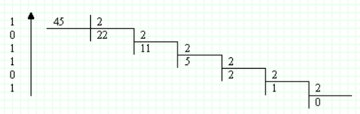

#Arithmetics

*(Time: 1 s, Memory: 16 Mb, Difficulty: 5%)*

Last year, Vasya went to school and learned to count. This year, 
he studied the multiplication table and now knows how to multiply 
any numbers from `1` to `10` without errors. A friend Petya told him 
about number systems other than decimal. In particular, about binary, 
octal and even hexadecimal. Now Vasya can easily (but already with 
the help of a piece of paper and a pen) multiply numbers from `1` to 
`10` in these systems, using the translation from a non-standard system 
to decimal and vice versa from decimal. For example, if Vasya needs 
to multiply the numbers `101` and `1001` in the binary system, then 
he first translates these numbers into a decimal representation as follows:

`(101)_2=1*2^2+0*2^1+1*2^0=4+0+1=5`

`(1001)_2=1*2^3+0*2^2+0*2^1+1*2^0=8+0+0+1=9`

After that, multiplying the numbers `5` and `9`, Vasya easily makes 
the decimal system in his head and gets the number `45`. Next, he 
translates from the decimal system to binary. To do this, Vasya divides 
the number `45` by `2` (the order of the number system), remembering 
the remainder of the division, until the result is the number `0`:

The answer is made up of the division residues obtained by writing them 
in the reverse order. Thus, Vasya gets the result: 

`(101)_2 * (1001)_2 = (101101)_2`
 
But now Vasya is studying the multiplication table for numbers from `1`
to `100` in the decimal system, and since it is very difficult to 
remember such a table, Vasya will have to cram it for a very long time. 
Create a program for Vasya that will help him test his knowledge.

##Input
The input file `INPUT.TXT` contains three natural numbers `A`, `B` and `C` 
separated by spaces. The numbers `A, B <= 10^2`, and `C <= 10^6`.

##Output
`YES` should be output to the output file if `A * B = C` and `NO` is 
output otherwise.

|**#** | **INPUT.TXT** | **OUTPUT.TXT** |
|---|---|-----|
|1|  8 54 432|  YES |
|2|  16 19 777|  NO |
